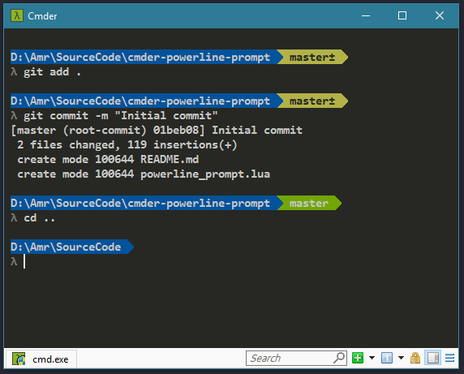

# Cmder-powerline-prompt

This is a custom prompt for [Cmder](http://cmder.net/) (the alternative console emulator for Windows).  
It looks like this:  


It has a blue background for the prompt.  
For folders with git repos, you get yellow background for changes, and green for clean repos.  
I'm using Consolas font.

The look is inspired by [Powerline for Vim](https://github.com/powerline/powerline), and [Zsh's theme agnoster](https://github.com/agnoster/agnoster-zsh-theme).

# Requirements

Download the [AnonymousPro font](https://github.com/powerline/fonts/tree/master/AnonymousPro)  
You'll be able to use any font in Cmder, but this font contains the symbols included in the prompt.  

# Usage

Download the `.lua` file, and place it in `%CMDER_ROOT%/config` folder.  
Restart Cmder to load the prompt.

__Alternatively__, if you want to maintain link with the original repo, you can clone this repo into any folder  
`git clone https://github.com/AmrEldib/cmder-powerline-prompt.git git-repo-folder-name`  
then create a symbolic link from the `%CMDER_ROOT%/config` folder to the `.lua` file.  
```
cd %CMDER_ROOT%/config  
mklink -H cmder-powerline-prompt.lua <git-repo-folder-name>/cmder-powerline-prompt.lua 
```  

# Helpful info for customizing Cmder 

## Links
[Cmder Source Code and README](https://github.com/cmderdev/cmder)  
[What is Clink](https://github.com/mridgers/clink/blob/master/docs/clink.md)  
[Clink API](https://github.com/mridgers/clink/blob/master/docs/api.md)  
[ANSI Color Sequence](http://ascii-table.com/ansi-escape-sequences.php)  

## Cmder Configurations
Cmder configurations is stored in `%CMDER_ROOT%\config\`  
You can add files to be loaded during startup in either of these folders  
        `%CMDER_ROOT%\config\profile.d`  
        `%CMDER_ROOT%\config`  
Add a `.ps1` file to be loaded for Powershell shells  
Add a `.bat` or `.cmd` files to be loaded for Windows Command shells  
Add a `.sh` file to be loaded for Bash shells  
User-specific configurations should go into files named `user-profile` with extensions `ps1`, `cmd`/`bat`, or `sh`.  

## Clink Prompt 
The file `%CMDER_ROOT%\vendor\clink.lua` sets the command prompt. See the function `set_prompt_filter`.
The prompt value is stored in [clink.prompt.value](https://github.com/mridgers/clink/blob/master/docs/api.md#clinkpromptvalue)  
Drop .lua files into the `%CMDER_ROOT%\Config` folder to customize the prompt.
